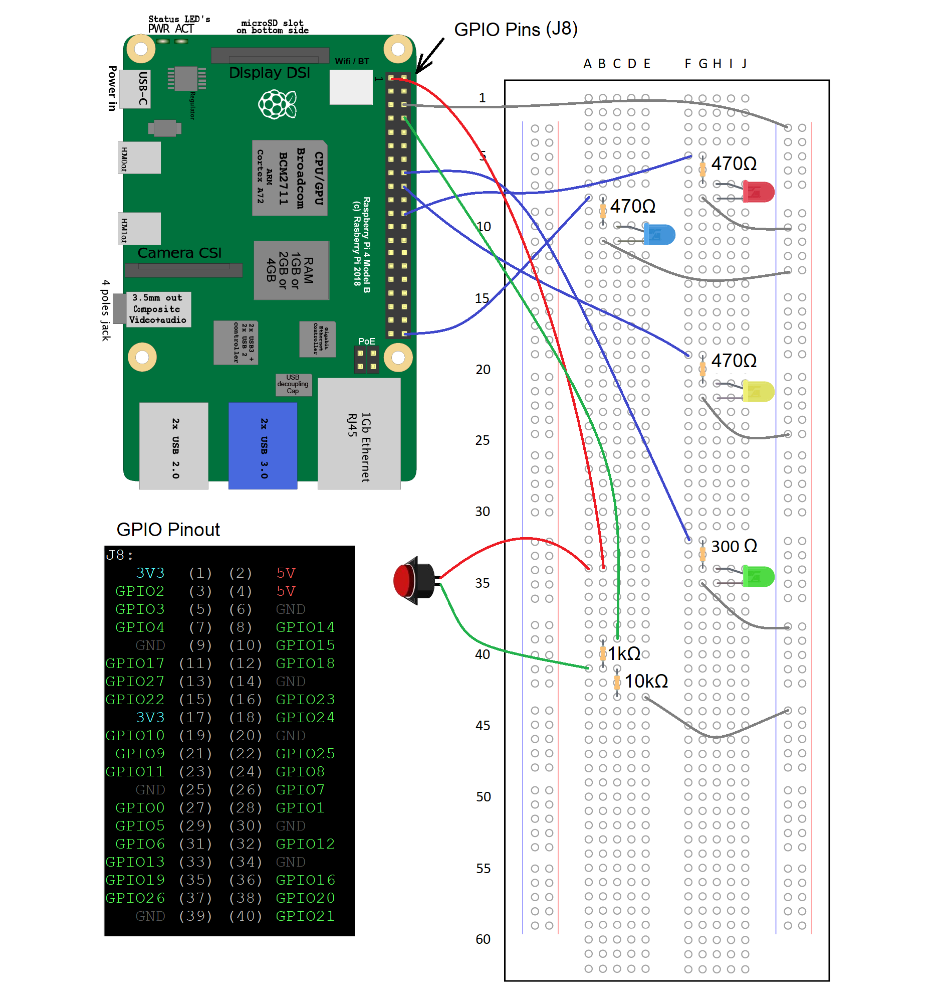

# pi Traffic Lights

This is a collection of Haskell programs that use the run on the
raspberry pi using the gpio pins as well as a simple worker thread
/ messaging thread demo since the concept is used in the traffic
light program.

## Getting Started

To keep things lightweight, stack was not installed on the raspberry
pi so for now only the libraries that come with GHC are used.
To install ghc o the pi, the following were used:
'''
  sudo apt-get update
  sudo apt-get install ghc --fix-missing
'''

examples can be compiled on the pi with a simple ghc command
'''
  ghc trafficlights.hs
'''

Wiring of the raspberry pi GPIO for the traffic light programs:

## Authors

* **Gord Duff** - *Initial work* - [gjduff](https://github.com/gjduff)
